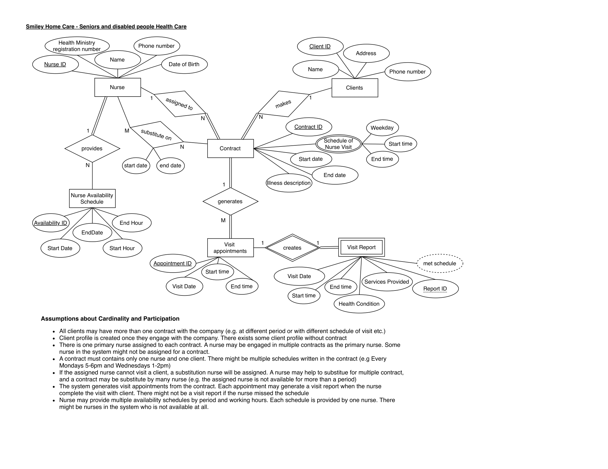

# Nurse Scheduling System

Welcome to the Nurse Scheduling System project! This system facilitates nurse-patient contract establishment and automatic schedule generation based on contract details. All data, including contracts, nurses, patients, and schedules, are stored in a SQL database, compatible with MySQL and MS SQL. Complex queries for data retrieval are provided in the `sql_scripts` folder, and a sample PHP frontend is implemented.

## Features

- **Contract Establishment:** Create detailed contracts specifying nurse-patient agreements, including schedule preferences.
- **Automatic Schedule Generation:** Generate nurse schedules automatically based on contract details, optimizing for patient needs and nurse availability.
- **Database Storage:** Store all data, including contracts, nurses, patients, and schedules, in a SQL database (MySQL and MS SQL compatible).
- **Complex Queries:** Utilize pre-written SQL scripts for complex data retrieval tasks, available in the `sql_scripts` folder.
- **Sample PHP Frontend:** Implement a sample PHP frontend for demonstration and testing purposes.

## ER Diagram

The Entity-Relation (ER) diagram of the database can be found above.

## Usage

1. Set up your SQL database environment (MySQL or MS SQL).
2. Execute the SQL scripts in the `sql_scripts` folder to create the necessary tables and populate them with sample data.
3. Configure the PHP frontend to connect to your database.
4. Access the PHP frontend to interact with the system and observe the generated schedules.

## Contributing

Contributions are welcome! If you have any ideas for improvements or find any issues, please feel free to submit a pull request.

## License

This project is licensed under the [MIT License](LICENSE).